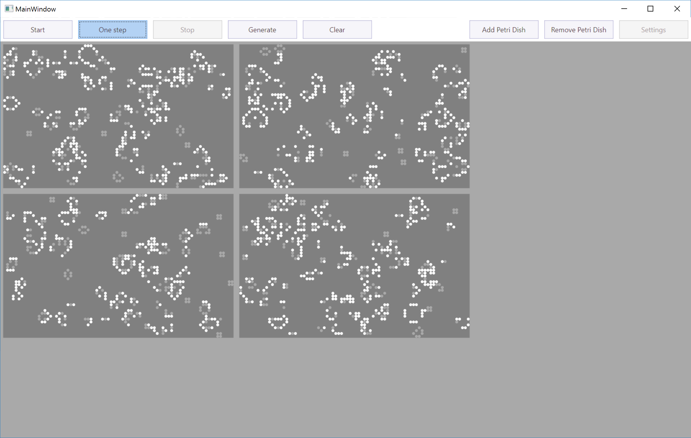

[](https://github.com/JetBrains)

# DotMemory Demos

This repository contains a demo application that can be used to demonstrate JetBrains [dotMemory](https://www.jetbrains.com/dotmemory) and [dotMemory Unit](https://www.jetbrains.com/dotmemory).

The demo application contains various memory issues, such as memory leaks, high memory traffic and so on. It is used in various [screencasts available from our documentation](https://www.jetbrains.com/dotmemory/documentation/).

## Demo application

The demo application is an implementation of [Conway's Game of Life](https://en.wikipedia.org/wiki/Conway%27s_Game_of_Life), where we can experiment with structures that evolve through generations.



The solution file contains two projects:

* **GameOfLife** - The Game of Life implementation, featuring various memory issues.
* **Tests** - Unit tests that use dotMemory Unit to validate memory behaviour.

### Profiling

The Game of Life can be profiled using [dotMemory](https://www.jetbrains.com/dotmemory), with various settings (such as collecting allocations or not).


There are various issues to be uncovered. Some are easy to find using dotMemory's automatic inspections, while others require a bit more investigation.

### Unit testing

Discovering memory issues is one thing, making sure they will not occur again is another. The tests project contains various unit tests that make use of [dotMemory Unit](https://www.jetbrains.com/dotmemory) and replay profiling sessions in code. These tests will fail when run, as the memory leaks are still in the code base. Throughout the code, there are also comments that help resolve the memory issues.

For example, this test verifies the amount of memory allocated during execution:

```csharp
[Test]
[AssertTraffic(AllocatedSizeInBytes = 2*Mb)] // --assert
public void WholeRunTraffic()
{
    // --act
    var target = new PetriDish(160, 100, timer);

    for (var i = 0; i < 100; i++)
        target.PerformOneStep();
}
```

Searching for `WholeRunTraffic` will pinpoint the location of the test failure and provide a hint for fixing it.
